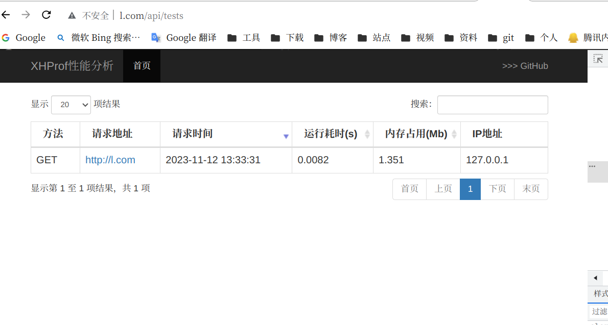

## 简介 ##
aaron-dev/xhprof-laravel是一款适配laravel的代码性能分析插件。
主要对旧版且无法使用的xhprof做优化调整，用于适配laravel，安装简单快捷。
开发者可以通过浏览器快速访问性能分析报告，排查代码性能问题。

## 安装 ##

php要安装xhprof扩展
在php.ini中增加配置
```
[xhprof]
extension=xhprof.so;
xhprof.output_dir=/tmp/xhprof;

```

Use [Composer](https://github.com/composer/composer):
```sh
composer require aaron-dev/xhprof-laravel
```
执行以下命令
 ```
  php artisan vendor:publish --provider="Aaron\Xhprof\XhprofServiceProvider"

 ```

## 配置 ##


1. 路由增加以下代码测试
```
use App\Http\Middleware\XhprofMiddleware;

Route::get('/', function () {
    return view('welcome');
})->middleware(XhprofMiddleware::class);


```


2. 基础配置在config/xhprof.php中

```

'enable' => true,
'time_limit' => 0,  //仅记录响应超过多少秒的请求  默认0记录所有
'log_num' => 1000, //仅记录最近的多少次请求(最大值有待观察，看日志、查看响应时间) 默认1000
'view_wtred' => 3, //列表耗时超过多少秒标红 默认3s
'ignore_url_arr' => ["/test"],  //忽略URL配置


```


3. 增加访问控制器，然后就可以访问了
```
<?php

namespace App\Http\Controllers;
use Aaron\Xhprof\Xhprof;

class IndexController extends Controller{


    public function index(){
        return Xhprof::index();
    }
}

```




本插件参考[phacility/xhprof](https://github.com/phacility/xhprof)、[phpxxb/xhprof](https://github.com/xiexianbo123/xhprof)、[aaron-dev/xhprof-webman](https://github.com/erikwang2013/xhprof-webman)